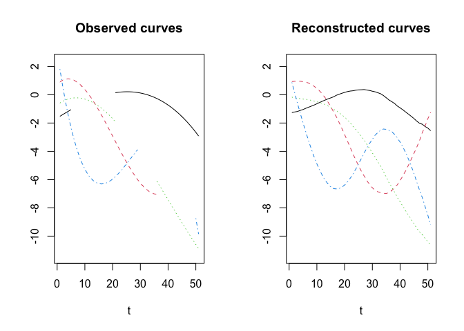

# Functional PCA for partially observed elliptical process

This is the R package `robfpca` implementing the robust functional
principal component analysis (FPCA) for partially observed functional
data from the following paper:

> Yeonjoo Park, Hyunsung Kim, and Yaeji Lim (2023). Functional principal
> component analysis for partially observed elliptical process,
> Computational Statistics & Data Analysis, 184, 107745.
> <https://doi.org/10.1016/j.csda.2023.107745>

The proposed robust FPCA method implements FPCA based on the conditional
expectation for the robust covariance function estimate. The robust
covariance function is obtained via robust pairwise computation based on
Orthogonalized Gnanadesikan-Kettenring (OGK) estimation.

## Installation

``` r
# install.packages("devtools")
devtools::install_github("statKim/robfpca")
```

## Example

### Generate partially observed functional data from heavy-tailed distribution

First, we generate 100 partially observed curves from heavy-tailed $t_3$
distribution.

``` r
library(robfpca)

# Generate partially observed curves from heavy-tailed distribution
set.seed(46)
X.list <- sim_delaigle(n = 100,
                       type = "partial",
                       dist = "tdist")
X <- list2matrix(X.list)   # transform list to matrix
gr <- seq(0, 1, length.out = ncol(X))   # observed timepoints
matplot(gr, t(X), 
        type = "l",
        xlab = "t", ylab = "X(t)")
```

<!-- -->

### Robust FPCA for partially observed functional data

``` r
# Proposed FPCA with bandwidth = 0.3
robfpca.obj <- robfpca.partial(X,
                               type = "huber",
                               # PVE = 0.99,
                               K = 4,   # we use true dimension
                               bw = 0.3)
fpc.score <- robfpca.obj$pc.score  # FPC scores
```

``` r
# First three eigenfunctions
eig.true <- get_delaigle_eigen(gr, model = 2)   # True eigenfunctions
eig.robfpca <- check_eigen_sign(robfpca.obj$eig.fun, 
                                eig.true)   # match eigen directions
par(mfrow = c(1, 3))
for (i in 1:3) {
    plot(gr, eig.true[, i],
         type = "l",
         lwd = 2,
         ylim = c(-2, 2.5),
         xlab = "t", 
         ylab = paste("PC", i),
         main = paste("Eigenfunction", i))
    lines(gr, eig.robfpca[, i], col = 2, lwd = 2)
    
    if (i == 1) {
        legend("bottomright", 
               c("True","Proposed"),
               lty = c(1, 1),
               col = c(1, 2))
    }
}
```

<!-- -->

### Predict FPC score

``` r
# Select 4 curves that have sufficiently long missing periods
set.seed(46)
idx <- sample(which(rowSums(is.na(X)) > 10), 4)
new_data <- X[idx, ]   # example of new data

# new_data <- X[c(1,4,5), ]   # example of new data

# Predict the FPC scores
pred_score <- predict(robfpca.obj, type = "score", newdata = new_data)
pred_score
```

    ##            [,1]       [,2]       [,3]        [,4]
    ## [1,] -0.7116388 -0.3615703  0.6759071 -0.07910960
    ## [2,] -2.8524672 -2.3204772 -1.9270308  0.93575874
    ## [3,] -3.6939285 -3.7898607  0.5239974  0.04816286
    ## [4,] -4.4199298 -1.1945791 -0.3064473 -1.97150245

### Reconstruction

``` r
pred_reconstr <- predict(robfpca.obj, type = "reconstr", newdata = new_data)
pred_reconstr[1, ]  # reconstructed curve of 1st new_data
```

    ##  [1] -1.25946932 -1.21793044 -1.18143397 -1.10809157 -1.04553346 -0.95882906
    ##  [7] -0.88287568 -0.80474060 -0.72707187 -0.63683477 -0.54545990 -0.45572524
    ## [13] -0.37291395 -0.29164612 -0.22142744 -0.14690783 -0.04027414  0.03449168
    ## [19]  0.10319543  0.16630596  0.22242092  0.26123046  0.28209797  0.32282591
    ## [25]  0.34409215  0.35249701  0.36783550  0.33438215  0.30303967  0.25084476
    ## [31]  0.20756159  0.14164998  0.06880079 -0.05709927 -0.21039141 -0.36986969
    ## [37] -0.48810767 -0.61684460 -0.79439291 -0.92480296 -1.06479476 -1.21844644
    ## [43] -1.36835918 -1.52072973 -1.68344640 -1.86366009 -2.01442258 -2.08598473
    ## [49] -2.24192840 -2.36004657 -2.53716565

``` r
par(mfrow = c(1, 2))
matplot(t(new_data), type = "l",
        ylim = range(pred_reconstr, new_data, na.rm = T) + c(-0.5, 0.5),
        xlab = "t", ylab = "", main = "Observed curves")
matplot(t(pred_reconstr), type = "l",
        ylim = range(pred_reconstr, new_data, na.rm = T) + c(-0.5, 0.5),
        xlab = "t", ylab = "", main = "Reconstructed curves")
```

<!-- -->

### Completion

``` r
pred_comp <- predict(robfpca.obj, type = "comp", newdata = new_data)
pred_comp[1, ]  # predicted missing parts of 1st new_data
```

    ##  [1]          NA          NA          NA          NA          NA -0.95882906
    ##  [7] -0.88287568 -0.80474060 -0.72707187 -0.63683477 -0.54545990 -0.45572524
    ## [13] -0.37291395 -0.29164612 -0.22142744 -0.14690783 -0.04027414  0.03449168
    ## [19]  0.10319543  0.16630596          NA          NA          NA          NA
    ## [25]          NA          NA          NA          NA          NA          NA
    ## [31]          NA          NA          NA          NA          NA          NA
    ## [37]          NA          NA          NA          NA          NA          NA
    ## [43]          NA          NA          NA          NA          NA          NA
    ## [49]          NA          NA          NA

``` r
matplot(t(new_data), type = "l",
        ylim = range(pred_comp, new_data, na.rm = T) + c(-0.5, 0.5),
        xlab = "t", ylab = "", main = "Completion")
matlines(t(pred_comp), type = "l", lty = 1, lwd = 2)
```

<!-- -->

## Reproducible Simulation Results

If you use `simulation.R` in
[Here](https://github.com/statKim/fpca-partial-obs-ellipt-proc), you can
obtain reproducible results in our paper.
