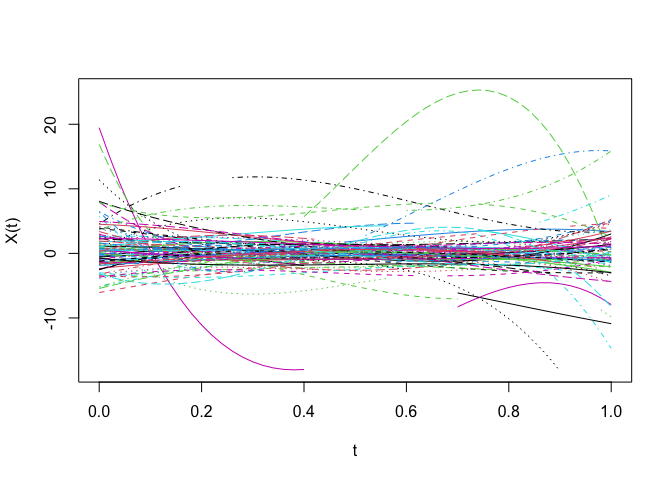
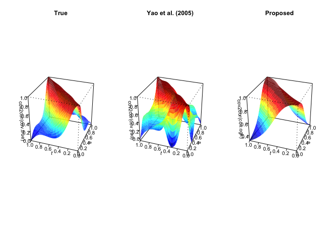
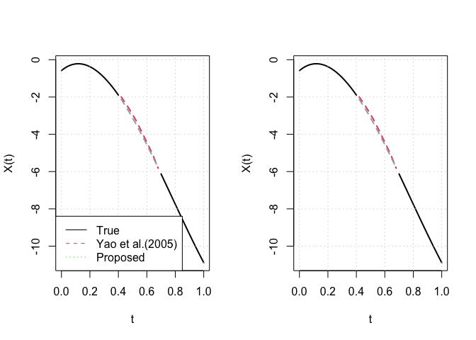

# Functional PCA for partially observed elliptical process

This is the R package `robfpca` implementing the robust functional
principal component analysis (FPCA) for partially observed functional
data.

The proposed robust FPCA method implements FPCA based on the conditional
expectation for the robust covariance function estimate. The robust
covariance function is estimated using the modified
Gnanadesikan-Kettenring (GK) identity based on M-estimator, and then
orthogonalized.

## Installation

``` r
# install.packages("devtools")
devtools::install_github("statKim/robfpca")
```

## Example

### Generate partially observed functional data from heavy-tailed distribution

First, we generate 100 partially observed curves from heavy-tailed
*t*<sub>3</sub> distribution.

``` r
library(robfpca)

# Generate partially observed curves from heavy-tailed distribution
set.seed(46)
x <- sim_delaigle(n = 100,
                  type = "partial",
                  dist = "tdist")
X <- list2matrix(x)   # transform list to matrix
gr <- seq(0, 1, length.out = 51)   # observed timepoints
matplot(gr, t(X), 
        type = "l",
        xlab = "t", ylab = "X(t)")
```

<!-- -->

### Robust mean and covariance estimation

We estimate the mean and covariance functions using `cov_ogk()` in this
package which implements proposed method via M-estimator and equation
(3.4) in our paper.

``` r
# Robust mean and covariance functions
cov.obj <- cov_ogk(X,
                   type = "huber",
                   MM = TRUE,
                   smooth = TRUE,
                   bw = 0.3)
mu.ogk <- cov.obj$mean
cov.ogk <- cov.obj$cov
noise.ogk <- cov.obj$noise.var
```

### Competing methods

We consider the non-robust FPCA method for the incomplete functional
data proposed by Yao et al. (2005).

``` r
### Yao et al. (2005)
library(fdapace)
bw <- 0.1   # fixed bandwidth
optns <- list(methodXi = "CE", dataType = "Sparse", kernel = "epan", 
              verbose = FALSE, error = FALSE,
              userBwMu = bw, userBwCov = bw)
mu.yao.obj <- GetMeanCurve(Ly = x$Ly, Lt = x$Lt, optns = optns)
cov.yao.obj <- GetCovSurface(Ly = x$Ly, Lt = x$Lt, optns = optns)
mu.yao <- mu.yao.obj$mu
cov.yao <- cov.yao.obj$cov
noise.yao <- 0
```

Following figures show the true and estimated correlation surfaces.

``` r
# Correlation surfaces
library(GA)
par(mfrow = c(1, 3))
cov.true <- get_delaigle_cov(gr, model = 2)   # True covariance function
persp3D(gr, gr, 
        cov2cor(cov.true),
        xlab = "s", ylab = "t",
        main = "True",
        theta = -70, phi = 30, expand = 1)
persp3D(gr, gr, 
        cov2cor(cov.yao),
        xlab = "s", ylab = "t", 
        main = "Yao et al. (2005)",
        theta = -70, phi = 30, expand = 1)
persp3D(gr, gr, 
        cov2cor(cov.ogk),
        xlab = "s", ylab = "t",
        main = "Proposed",
        theta = -70, phi = 30, expand = 1)
```

<!-- -->

### Functional principal component analysis

We perform FPCA based on the conditional expectation. (Yao et
al. (2005))

``` r
# Yao et al.(2005)
pca.yao.obj <- funPCA(Lt = x$Lt, 
                      Ly = x$Ly,
                      mu = mu.yao, 
                      cov = cov.yao, 
                      sig2 = noise.yao,
                      work.grid = gr,
                      K = 4)

# Proposed
pca.ogk.obj <- funPCA(Lt = x$Lt, 
                      Ly = x$Ly,
                      mu = mu.ogk, 
                      cov = cov.ogk, 
                      sig2 = noise.ogk,
                      work.grid = gr,
                      K = 4)
```

``` r
# Plot 1~3 eigenfunctions
eig.true <- get_delaigle_eigen(gr, model = 2)   # True eigenfunctions
eig.yao <- check_eigen_sign(pca.yao.obj$eig.fun, 
                            eig.true)   # match eigen directions
eig.ogk <- check_eigen_sign(pca.ogk.obj$eig.fun, 
                            eig.true)   # match eigen directions
par(mfrow = c(1, 3))
for (i in 1:3) {
    plot(gr, eig.true[, i],
         type = "l",
         lwd = 2,
         ylim = c(-3, 3),
         xlab = "t", 
         ylab = paste("PC", i))
    lines(gr, eig.yao[, i], col = 2, lwd = 2)
    lines(gr, eig.ogk[, i], col = 3, lwd = 2)
    
    if (i == 1) {
        legend("bottomright", 
               c("True","Yao et al.(2005)","Proposed"),
               lty = c(1, 1, 1),
               col = c(1, 2, 3))
    }
}
```

<!-- -->

### Completion and reconstruction for missing parts

``` r
# Curve reconstruction
pred_yao_mat <- predict(pca.yao.obj, K = 4)
pred_ogk_mat <- predict(pca.ogk.obj, K = 4)


### Completion and Reconstruction example
i <- 1   # 1st curve
NA_ind <- which(is.na(X[i, ]))   # index of missing periods

par(mfrow = c(1, 2))

# Completion
matplot(gr, 
        cbind(X[i, ], 
              pred_missing_curve(X[i, ], pred_yao_mat[i, ], conti = FALSE),
              pred_missing_curve(X[i, ], pred_ogk_mat[i, ], conti = FALSE)),
        type = "l",
        lwd = 2,
        xlab = "t", ylab = "X(t)")
lines(gr[NA_ind], 
      x$x.full[i, NA_ind],
      col = "darkgray", lty = 2, lwd = 2)
grid()
legend("bottomleft", 
       c("True","Yao et al.(2005)","Proposed"),
       lty = 1:3,
       col = 1:3)

# Reconstruction
matplot(gr, 
        cbind(X[i, ], 
              pred_yao_mat[i, ],
              pred_ogk_mat[i, ]),
        type = "l",
        lwd = 2,
        xlab = "t", ylab = "X(t)")
lines(gr[NA_ind], 
      x$x.full[i, NA_ind],
      col = "darkgray", lty = 2, lwd = 2)
grid()
```

<!-- -->

## Reproducible Simulation Results

If you use `simulation.R` in
[Here](https://github.com/statKim/fpca-partial-obs-ellipt-proc), you can
obtain reproducible results in our paper.

## Reference

-   Park, Y., Kim, H. and Lim, Y. (2023+). Functional principal
    component analysis for partially observed elliptical process, *Computational Statistics & Data Analysis*, accepted.
    
-   Yao, F., Müller, H. G., & Wang, J. L. (2005). Functional data
    analysis for sparse longitudinal data. *Journal of the American
    statistical association*, 100(470), 577-590.
